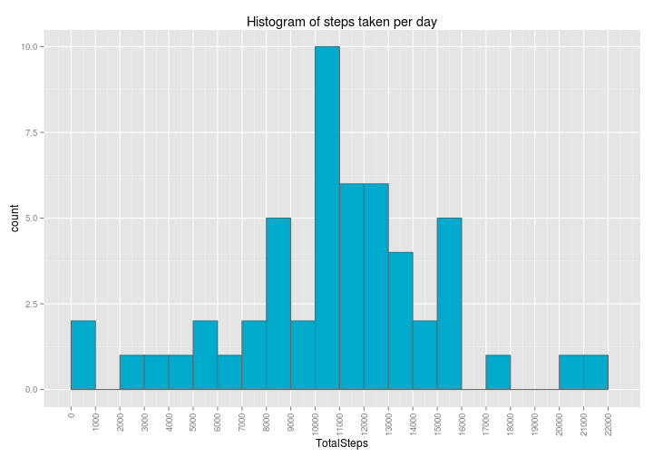
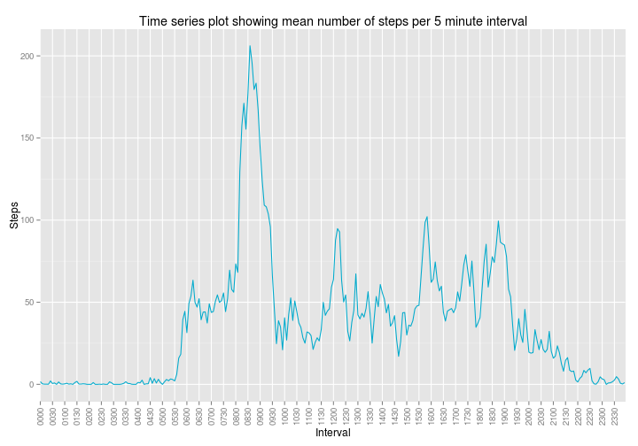
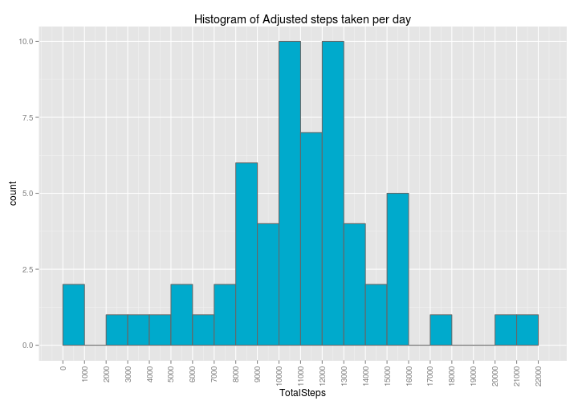
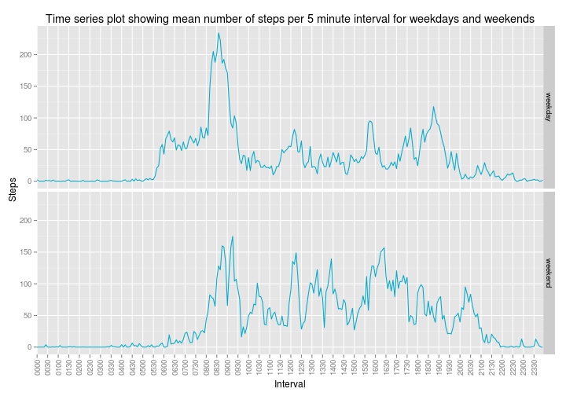

Reproducible Research - Peer Assessment One
========================================================


This analysis answers Peer Assessment One of the Reproducible Research module - part of the Coursera Data Science Specialization course delivered by Johns Hopkins Bloomberg School of Public Health.  

This assignment makes use of data from a personal activity monitoring device. This device collects data at 5 minute intervals through out the day. The data consists of two months of data from an anonymous individual collected during the months of October and November, 2012 and include the number of steps taken in 5 minute intervals each day

Note that for readability, some of the statistics reported are rendered "in-line" using the &#96;r someVariable&#96; syntax.  In every case where this technique has been applied the R code for calculating the variable is presented in a preceeding, visible R chunk.

We assume the data is in the current working directory in a zip file called activity.zip.  Unzip the archive and read in the csv file then inspect the resulting data to see what we have.


```r
opts_chunk$set(fig.width=10, echo=TRUE)
unzip("activity.zip")
activity <- read.table("activity.csv", sep=",", header=T)
str(activity)
```

```
## 'data.frame':	17568 obs. of  3 variables:
##  $ steps   : int  NA NA NA NA NA NA NA NA NA NA ...
##  $ date    : Factor w/ 61 levels "2012-10-01","2012-10-02",..: 1 1 1 1 1 1 1 1 1 1 ...
##  $ interval: int  0 5 10 15 20 25 30 35 40 45 ...
```

```r
head(activity)
```

```
##   steps       date interval
## 1    NA 2012-10-01        0
## 2    NA 2012-10-01        5
## 3    NA 2012-10-01       10
## 4    NA 2012-10-01       15
## 5    NA 2012-10-01       20
## 6    NA 2012-10-01       25
```

```r
summary(activity)
```

```
##      steps               date          interval   
##  Min.   :  0.0   2012-10-01:  288   Min.   :   0  
##  1st Qu.:  0.0   2012-10-02:  288   1st Qu.: 589  
##  Median :  0.0   2012-10-03:  288   Median :1178  
##  Mean   : 37.4   2012-10-04:  288   Mean   :1178  
##  3rd Qu.: 12.0   2012-10-05:  288   3rd Qu.:1766  
##  Max.   :806.0   2012-10-06:  288   Max.   :2355  
##  NA's   :2304    (Other)   :15840
```


Calculate the total number of steps taken  day across the entire data set, ignoring missing values. Plot a histogram of the results:


```r
library(ggplot2)
commonColour <- "#00aacc"
stepsPerDay <- aggregate(activity$steps, by=list(activity$date), FUN="sum")
names(stepsPerDay) <- c("Date", "TotalSteps")
ggplot(stepsPerDay, aes(TotalSteps)) + 
  geom_histogram(binwidth=1000, color="#666666",fill=commonColour) + 
  scale_x_continuous(breaks=seq(from=0, to=max(stepsPerDay$TotalSteps, na.rm=T) + 1000, by=1000), limits = c(0, max(stepsPerDay$TotalSteps, na.rm=T) + 1000)) +
  ggtitle("Histogram of steps taken per day") +
  theme(axis.text.x=element_text(angle=90,hjust=1,vjust=0.5))
```

 


Calculate the mean and median for the total number of steps taken per day across the entire dataset.


```r
meanStepsPerDay <- format(mean(stepsPerDay$TotalSteps, na.rm=T), big.mark = ',', digits=7)
medianStepsPerDay <- format(median(stepsPerDay$TotalSteps, na.rm=T), big.mark = ',', digits=7)
```


The mean number of steps taken per day is **10,766.19** and the median number of steps taken per day is **10,765**.

We now calculate the mean steps taken per day for each of the 5 minute intervals and use this to produce a time series plot.  Note that we first convert the intervals variable into two new variables, IntervalSeconds and IntervalFormatted.  We use the IntervalSeconds to plot the data and the IntervalFormatted for the tick labels.


```r
stepsPerDayFive <- aggregate(activity$steps, by=list(activity$interval), FUN=mean, na.rm=T)
names(stepsPerDayFive) <-c("Interval", "Steps")
#This gives us actual seconds not hour second units
stepsPerDayFive$IntervalSeconds <- seq(from=0, to=1435, by=5)
#This gives us zero padded hour second units
stepsPerDayFive$IntervalFormatted <- sprintf('%04d', stepsPerDayFive$Interval)
#This gives us 30 minute tick marks
tickmarks <- seq(1,288, 6)
ggplot(stepsPerDayFive, aes(IntervalSeconds,Steps))+ 
  geom_line(color = commonColour) + 
  scale_x_discrete(breaks = stepsPerDayFive$IntervalSeconds[tickmarks],labels=stepsPerDayFive$IntervalFormatted[tickmarks]) + 
  theme(axis.text.x=element_text(angle=90,hjust=1,vjust=0.5)) +
  ggtitle("Time series plot showing mean number of steps per 5 minute interval") +
  xlab("Interval")
```

 

```r
#calculate max steps
maxSteps <- stepsPerDayFive[stepsPerDayFive$Steps == max(stepsPerDayFive$Steps),c("Steps", "IntervalFormatted")]

#calculate missing values
missingValues <- format(sum(is.na(activity$steps)), big.mark = ',')
```


The 5 minute interval containing the maximum number of steps on average across the entire data set is the interval beggining at **0835** which on average saw **206.1698** steps.


There are **2,304** observations in the data set for which the number of steps per 5 minute interval is not known (NA).  We now replace these NA values using the following strategy:

* determine the day of the week for each observation
* create a new dataset called dayAverages which is the mean value by day of week for the entire dataset
* create an adjusted data set by joining our dayAverages data with the original activity data by matching on date and interval
* replace NA values in out adjusted data set with the mean for the corresponding day of the week


```r
activity$DayOfWeek <- weekdays(as.Date(activity$date))
dayAverages <- aggregate(activity$steps, by=list(activity$DayOfWeek, activity$interval), FUN=mean, na.rm=T)
names(dayAverages) <- c("DayOfWeek", "Interval", "MeanSteps")
dayAverages$MeanSteps <- as.integer(round(dayAverages$MeanSteps))
activityAdjusted <- merge(activity, dayAverages, by.x=c("DayOfWeek","interval"), by.y=c("DayOfWeek", "Interval"))
#order the same as original data
activityAdjusted <- activityAdjusted[order(activityAdjusted$date, activityAdjusted$interval),c("MeanSteps", "date","interval", "DayOfWeek")]
```


We now run some sanity checks to make sure our data looks correct by comparing our adjusted data to our original data:


```r
head(activity)
```

```
##   steps       date interval DayOfWeek
## 1    NA 2012-10-01        0    Monday
## 2    NA 2012-10-01        5    Monday
## 3    NA 2012-10-01       10    Monday
## 4    NA 2012-10-01       15    Monday
## 5    NA 2012-10-01       20    Monday
## 6    NA 2012-10-01       25    Monday
```

```r
head(activityAdjusted)
```

```
##      MeanSteps       date interval DayOfWeek
## 2593         1 2012-10-01        0    Monday
## 4620         0 2012-10-01        5    Monday
## 2604         0 2012-10-01       10    Monday
## 3241         0 2012-10-01       15    Monday
## 3808         0 2012-10-01       20    Monday
## 4339         5 2012-10-01       25    Monday
```

```r
activity[ activity$DayOfWeek =='Friday' & activity$interval == 1200,]
```

```
##       steps       date interval DayOfWeek
## 1297    138 2012-10-05     1200    Friday
## 3313     70 2012-10-12     1200    Friday
## 5329      0 2012-10-19     1200    Friday
## 7345      0 2012-10-26     1200    Friday
## 9361      0 2012-11-02     1200    Friday
## 11377    NA 2012-11-09     1200    Friday
## 13393   190 2012-11-16     1200    Friday
## 15409     0 2012-11-23     1200    Friday
## 17425    NA 2012-11-30     1200    Friday
```

```r
activityAdjusted[ activityAdjusted$DayOfWeek =='Friday' & activityAdjusted$interval == 1200,]
```

```
##     MeanSteps       date interval DayOfWeek
## 287        57 2012-10-05     1200    Friday
## 281        57 2012-10-12     1200    Friday
## 288        57 2012-10-19     1200    Friday
## 286        57 2012-10-26     1200    Friday
## 285        57 2012-11-02     1200    Friday
## 284        57 2012-11-09     1200    Friday
## 283        57 2012-11-16     1200    Friday
## 282        57 2012-11-23     1200    Friday
## 280        57 2012-11-30     1200    Friday
```

```r
dayAverages[ dayAverages$DayOfWeek == 'Friday' & dayAverages$Interval == 1200,]
```

```
##      DayOfWeek Interval MeanSteps
## 1009    Friday     1200        57
```

We can now add step values from original data to our adjusted data and create a new column in our adjusted data which is either the original steps value for the given observation if the value is not NA, or the mean for that interval for the corresponding day otherwise


```r
activityAdjusted$OrigSteps <- activity$steps
head(activityAdjusted)
```

```
##      MeanSteps       date interval DayOfWeek OrigSteps
## 2593         1 2012-10-01        0    Monday        NA
## 4620         0 2012-10-01        5    Monday        NA
## 2604         0 2012-10-01       10    Monday        NA
## 3241         0 2012-10-01       15    Monday        NA
## 3808         0 2012-10-01       20    Monday        NA
## 4339         5 2012-10-01       25    Monday        NA
```

```r
activityAdjusted$AdjustedSteps <- mapply(FUN=function(x,y ){
  if(is.na(x)) 
    y 
  else x
  },
  activityAdjusted$OrigSteps, 
  activityAdjusted$MeanSteps)
```

We can now plot the adjusted data to compare to our histogram for the original data


```r
stepsPerDayAdjusted <- aggregate(activityAdjusted$AdjustedSteps, by=list(activityAdjusted$date), FUN="sum")
names(stepsPerDayAdjusted) <- c("Date", "TotalSteps")
ggplot(stepsPerDayAdjusted, aes(TotalSteps)) + 
  geom_histogram(binwidth=1000, color="#666666",fill=commonColour) + 
  scale_x_continuous(breaks=seq(from=0, to=max(stepsPerDayAdjusted$TotalSteps) + 1000, by=1000),limits = c(0, max(stepsPerDayAdjusted$TotalSteps) + 1000)) +
  ggtitle("Histogram of Adjusted steps taken per day") +
  theme(axis.text.x=element_text(angle=90,hjust=1,vjust=0.5))
```

 

We can now generate some basic statistics to compare this data set to our original activity data set:


```r
meanStepsPerDayAdjusted <- format(mean(stepsPerDayAdjusted$TotalSteps), big.mark = ',', digits=7)
medianStepsPerDayAdjusted <- format(median(stepsPerDayAdjusted$TotalSteps), big.mark = ',', digits=7)
origNonNAObservations <- format(sum(!is.na(activity$steps)), big.mark= ',')
adjustedNonNAObservations <-format(sum(!is.na(activityAdjusted$AdjustedSteps)), big.mark= ',')
```

The impact of imputing missing data appears to generally increase the average total number of steps per day.  An NA value will not contribute to the total number of steps wheras an imputed value can either not contribute if it is zero, or contribute if it is above zero.  We can see this by comparing the total number of steps in each data set:


```r
sum(stepsPerDay$TotalSteps, na.rm = T)
```

```
## [1] 570608
```

```r
sum(stepsPerDayAdjusted$TotalSteps)
```

```
## [1] 660087
```


We see a corresponding increase in the mean for the distribution: **10,821.1** (up from 10,766.19) and the median: **11,015** (up from 10,765) compared to our original data. We also see more contributing observations in the data:  **17,568** versus **15,264**


Lastly we examine the differences in steps per day from our original data if the day is a weekday or a weekend.  First we need to label our original observations in the activity data set with a 2 level factor weekday/weekend:


```r
activity$DayType <- sapply(activity$DayOfWeek,FUN=function(x){
  if(x == "Saturday" | x == "Sunday")
    "weekend"
  else
    "weekday"
  }, simplify=TRUE)
```

Now we can create two time series plots based upon the day type:


```r
stepsPerDayType <- aggregate(activity$steps, by=list(activity$interval, activity$DayType), FUN=mean, na.rm=T)
names(stepsPerDayType) <-c("Interval", "DayType", "Steps")
#This gives us actual seconds not hour second units
stepsPerDayType$IntervalSeconds <- seq(from=0, to=1435, by=5)
#This gives us zero padded hour second units
stepsPerDayType$IntervalFormatted <- sprintf('%04d', stepsPerDayType$Interval)
#tickmarks is still available, we re-state it here for clarity
tickmarks <- seq(1,288, 6)
ggplot(stepsPerDayType, aes(IntervalSeconds,Steps)) +
    geom_line(colour=commonColour) +
    facet_grid(DayType~.) +
    scale_x_discrete(breaks = stepsPerDayType$IntervalSeconds[tickmarks],labels=stepsPerDayType$IntervalFormatted[tickmarks]) + 
    theme(axis.text.x=element_text(angle=90,hjust=1,vjust=0.5)) +
    ggtitle("Time series plot showing mean number of steps per 5 minute interval for weekdays and weekends") +
    xlab("Interval")
```

 

That completes the analysis for this assessment.

